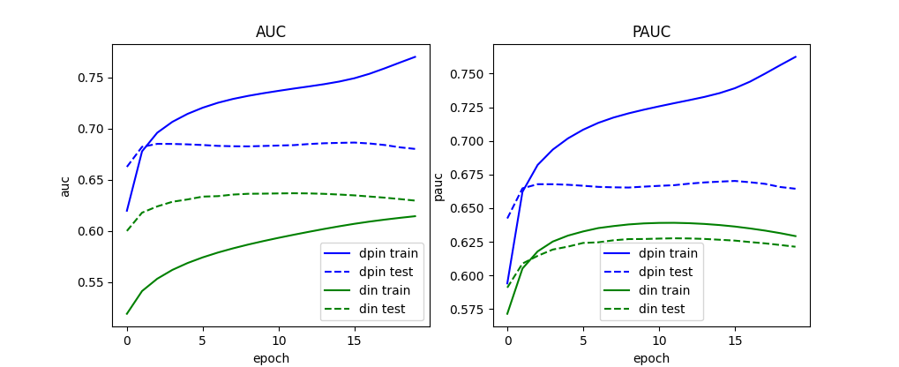

# Paddle-DPIN
飞桨论文复现: [Deep Position-wise Interaction Network for CTR Prediction](https://arxiv.org/pdf/2106.05482v2.pdf)

## 论文介绍

位置偏差是推荐系统有偏数据中的一个典型偏差类型，主要表现在列表中靠前的商品更容易被用户点击，而不是因为用户喜欢。传统方法认为点击率等于检查概率和关联概率的乘积，这种假设太多简单，不足以模拟位置和其他信息之间的交互。因此论文《Deep Position-wise Interaction Network for CTR Prediction》综合考虑位置、用户、上下文之间的非线性交互，提出DPIN模型。

## 数据集选择

使用KDD Cup 2012，Track2的赛题数据，该数据集用于搜索广告系统中的CTR预估，提供了用户在腾讯搜索中的查询词、广告信息、广告相对位置、用户点击情况、用户属性信息等。与本论文所描述的场景以及试图解决的问题相吻合。

数据集地址：https://www.kaggle.com/competitions/kddcup2012-track2/data

这里我们只使用到了`training.txt`文件，文件大小9.87GB。总共有149639106条数据，每条数据包含如下信息：click、impression、displayURL、adID、advertiseID、depth、position、queryID、keywordID、titleID、descriptionID、userID。这里我们只选择使用如下信息：click、adID、advertiseID、position、userID。

为了与DIN模型进行对比，这里还需要为DIN模型生成相应的训练数据。DIN模型并未将广告的位置信息引入模型，因此除去position字段信息即可。具体训练数据生成方法详见`preprocess.py`。

## 模型组网

模型有三个模块组成：Base Module、Combination Module、Interaction Module。Base Module模块用于将用户特征、商品特征和上下文特征融合。Interaction Module模块用于生成与商品内容无关的位置特征，其中使用到了Attention与Tramsformer机制。而Combination Module模块将交互后的物品特征与每个位置特征交互，产生出每个商品在每个位置的CTR。

## 实验结果

我们选择了数据集中的前5000w条记录训练模型，对DIN和DPIN模型分别训练20轮左右。我们发现DPIN相较于DIN模型可以更快的收敛并且在训练集上取得0.76左右的AUC分数。在测试集中，作者提出的模型最好成绩中AUC为0.68，PAUC为0.67，而对于用于比较的DIN模型来说，最好成绩的AUC为0.63，PAUC为0.62。虽然使用的数据集不一样，但是可以证明模型的有效性。AUC、PAUC和Loss曲线如下图所示，发现DPIN模型可以快速收敛并稳定。

注1: DIN模型的实现参考的是飞桨模型库中的[DIN模型](https://github.com/PaddlePaddle/PaddleRec/blob/master/models/rank/din/README.md).

注2: DIN模型使用的Embedding维度为64维,学习率0.85;DPIN模型使用的Embedding维度为64维,学习率0.5.

注3: 训练日志分别参考trainer-din.log和trainer-dpin.log

